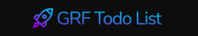
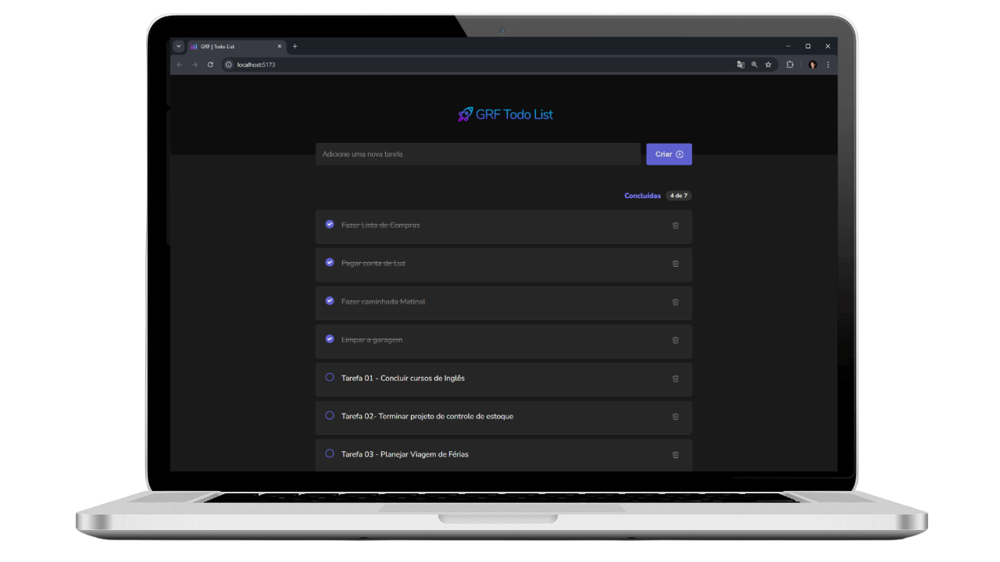
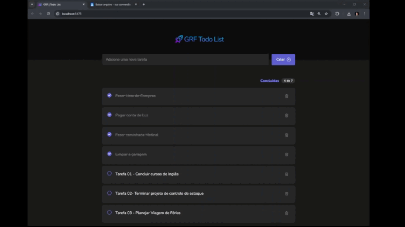
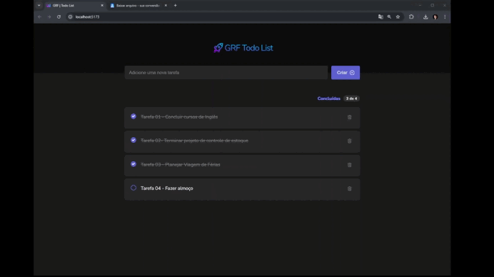
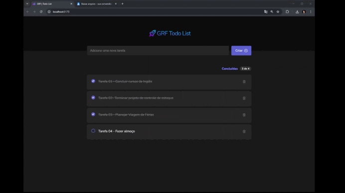

<!---------- Title/ Logo -------------->
<h1 align="center">
  
</h1>

<!-- ------- Ancoras --------------->
<p align="center">
  <a href="#-sobre">Sobre</a>&nbsp;&nbsp;&nbsp;|&nbsp;&nbsp;&nbsp;
  <a href="#-projeto">Projeto</a>&nbsp;&nbsp;&nbsp;|&nbsp;&nbsp;&nbsp;
  <a href="#-telas">Telas</a>&nbsp;&nbsp;&nbsp;|&nbsp;&nbsp;&nbsp;
  <a href="#-tecnologias">Tecnologias</a>&nbsp;&nbsp;&nbsp;|&nbsp;&nbsp;&nbsp;
  <a href="#-licença">Licença</a>
</p>

<!---------- Badges ----------------->
<p align="center">
  
  
  
  
  <!----(4953b8)--BlueDark -->
  <!----(49AA26)--Green -->
  <!----(008ed6)--Blue -->
  <!----(3292a6)--BlueMedium-->
  <!----(015F43)--GreenMedium-->
  <!----(8284FA)--purple-->
  <!----(5E60CE)--purpleDark-->
</p>

<br>
<!---------- showcase  ----------------->  
<p align="center">
  
</p>

 <!----- Acess Deploy Demonstration-->
 <!--h5 align="center">
    🎬 Clique Aqui: &nbsp; <a href="https://event-platform-gold.vercel.app/">  Visualizar Demonstração </a> 
 </h5 -->


<!----- Description ------------------>
## 🔖 Sobre

&nbsp;&nbsp;&nbsp;&nbsp;Este projeto foi desenvolvido como parte do curso **ReactJS 18 com TypeScript** da [Udemy Cursos](https://www.udemy.com/). Trata-se de um conteúdo bem elaborado sobre o desenvolvimento de uma aplicação **Todo List**, construído com foco no aprendizado e na aplicação prática dos principais conceitos dessa tecnologia, incluindo a criação do projeto com o [Vite](https://vite.dev/guide/).

&nbsp;&nbsp;&nbsp;&nbsp;O projeto, denominado **Todo List**, tem como objetivo permitir a criação de uma lista de tarefas pessoais, com os dados armazenados localmente no navegador (Local Storage) da própria máquina do usuário.  
&nbsp;&nbsp;&nbsp;&nbsp;O sistema apresenta uma interface limpa, com um layout responsivo e bem estruturado, servindo como um exemplo prático para a construção de listas de tarefas.

<br>

## 💻 Projeto

&nbsp;&nbsp;&nbsp;&nbsp;O desenvolvimento foi baseado em conceitos de arquitetura e no uso de plugins do **React.js**, com dependências da biblioteca **TypeScript**. Foram utilizados componentes organizados em contextos, seguindo boas práticas de desenvolvimento.

&nbsp;&nbsp;&nbsp;&nbsp;Durante o curso **ReactJS 18 com TypeScript**, foram explorados diversos conceitos fundamentais e avançados dessas tecnologias. O projeto foi desenvolvido com o objetivo de aplicar na prática conceitos-chave como **hooks**, **Context API**, estilização e outros recursos essenciais.  
&nbsp;&nbsp;&nbsp;&nbsp;Este projeto serviu como uma importante base de aprendizado para aprofundar meus conhecimentos em **ReactJS** e **TypeScript**.
 
  
<br>

 ###### **Curso :** ReactJS 18 com Type ScriptScript - [Udemy Cursos](https://www.udemy.com/course/reactjs-e-typescript-com-projetos-praticos-do-basico-ao-avancado/?couponCode=ACCAGE0923)
 ###### **Instrutor :** Gabriel Ferrante-GRF Cursos

<br>

<!----- Showcase Screens Shot------------------>
## 💻 **Telas**

<div align="center">





</div>
<br>
<br>

<!----- Pré Requisitos ---------------------------->

## 🚀 Tecnologias

- [HTML5](https://pt.wikipedia.org/wiki/HTML5) - Hyper Text Markup Language - linguagem de marcação de hipertexto.
- [React](https://reactjs.org/) -Biblioteca JavaScript para criação de Interfaces (Front-End).
- [TypeScript](https://www.typescriptlang.org/) - Conjunto da linguagem JavaScript com definições de tipo estático.
- [Node.js](https://nodejs.org/en/) - Ambiente de execução Javascript server-side.
- [VS Code](https://code.visualstudio.com/) - Editor de desenvolvimento de aplicações web.
- [Vite ](https://vite.dev/guide/) - Ferramenta de build desenvolvida para fornecer um ambiente de desenvolvimento rápido e eficiente para projetos front-end.
- [Vercel](https://vercel.com/) - Plataforma voltada para a hospedagem de aplicações.

<br>

## 📝 Licença
<a href="https://opensource.org/licenses/MIT">
    
</a>

 &nbsp;&nbsp;&nbsp;&nbsp;Esse projeto está sob a licença MIT. Veja o arquivo [LICENSE](https://opensource.org/licenses/MIT) para mais detalhes.

 <br>

<!----- Configurations ---------------------------->
 ## 📌 Instruções : 

Para iniciar o Servidor da aplicação use o comando: **_npm run dev_** então acesse pelo navegador **_http://localhost:5173/_** 

<br>

## 📁 Como Baixar o Projeto

```bash
  # Clonar o repósitorio
  $ git clone https://github.com/alxlima/todo-list-react.git

  # Instalar as dependências
  $ npm install
  
  # Iniciar o Projeto
  $ npm run dev
```
#
 Desenvolvido 🚀 por: ***_Alex Sandro da Silva lima_***


[](https://www.linkedin.com/in/alex-sandro-da-silva-lima-8b297839/) 
[](mailto:alex_lima2013@hotmail.com)

